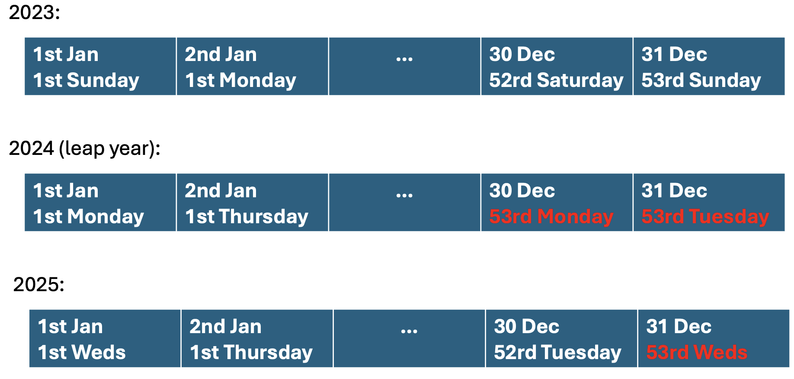
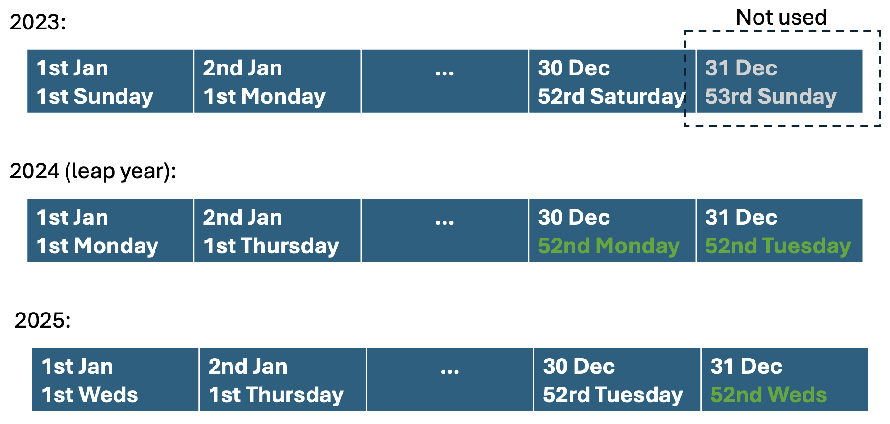

```{r setup, include = FALSE, warning=FALSE, message=FALSE}
knitr::opts_chunk$set(
  collapse = TRUE,
  comment = "#>",
  fig.align = "center"
)

library(timefully)
library(dplyr)
library(lubridate)
```

When adapting time series data to new date ranges with `adapt_timeseries()`,
we sometimes encounter gaps in the output where no historical data is available to fill in.
This vignette explains why these gaps occur and how we handle them.


## How `adapt_timeseries()` works

This function adapts the date range of a time series by reusing historical patterns based on the
same weekday occurrence within the year and decimal hour of the day. For example, if we 
have 2023 data and we want to fill in data for 01/01/2025 02:30, we see that it's the 
**first Thursday of 2025**, so we use the observation from 2.5 hours on the first Thursday of 2023.

In summary, the `adapt_timeseries()` function consists in two main actions:

1. **Check the input series.** The function looks for missing values in every column after `datetime`. 
If there are `NA` values and `fill_gaps = FALSE` it stops early with an informative error; otherwise it calls `fill_from_past()` so the input itself has no gaps.
2. **Adapt date range** For every pair of `ywday()` (weekday occurrence within the year) and `dhours()` (decimal hour) 
the function grabs the most recent observation and copies it into missing rows with the same pair.


## The full-year problem

This pipeline works well until we cross years with a different number of weekdays. 
In the example below we see that 2023 has 52 Mondays and Tuesdays, while 2024 (a leap year) has 53 of each.
This means that we can't find historical data for the "53rd Monday" or "53rd Tuesday" of 2024, 
because they simply do not exist in 2023, so the output keeps `NA`.

```{r problem-illustration, echo=FALSE, out.width="90%", fig.alt="Table comparing 2023, 2024 leap year, and 2025 weekdays showing extra 53rd Monday and Tuesday in 2024 and 2025 outlined in red."}

```

To cover those extra weekdays we use a second step: whenever the join fails but the missing data is limited to at most two consecutive days (to cover leap years), 
we call `fill_from_past()` and copy the most recent observation for the same clock time one week earlier. 
This reaches back to the "52nd Monday/Tuesday" that does exit, which fills the previously empty rows.

```{r solution-illustration, echo=FALSE, out.width="90%", fig.alt="Table highlighting that the 53rd Sunday from 2023 is unused while the 52nd Monday and Tuesday from 2024 supply data for 2025, marked in green."}

```

This provides stable results across leap years without inventing new patterns that never existed in the input.


## Guard rails when we do not have enough history

If we try to extrapolate further — say we only have a single month of data and request an entire year — the number of missing days is greater than two. 
In that case we deliberately avoid `fill_from_past()` and emit a warning so that users can fetch more data instead of silently manufacturing values. 

```{r too-many-gaps, message=FALSE, warning=FALSE}
short_month <- timefully::dtf |> filter(month(datetime) == 4)

new_range <- adapt_timeseries(
  short_month,
  start_date = as.Date("2025-04-15"),
  end_date = as.Date("2025-05-15"),
  tzone = "Europe/Paris",
  fill_gaps = FALSE
)

new_range |>
  filter(month(datetime) == 5)
```

With these safeguards in place we get the best of both worlds: automatic repairs for the full-year edge case, 
and clear feedback when the input is simply too small to support the requested period.
